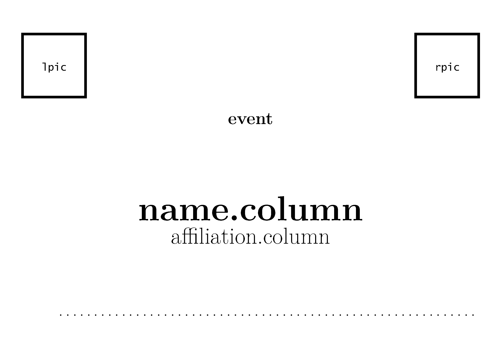
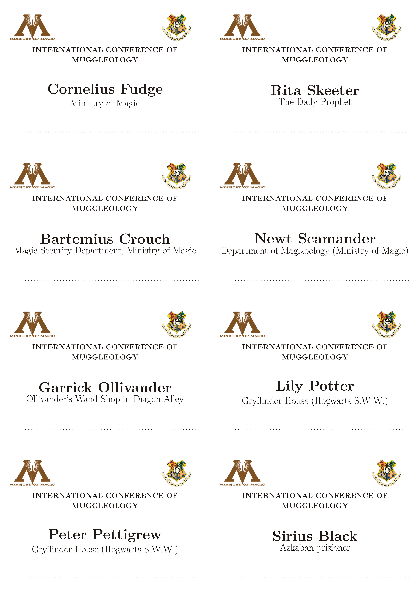

<!-- README.md is generated from README.Rmd. Please edit that file -->

```{r, include = FALSE}
knitr::opts_chunk$set(
  collapse = TRUE,
  comment = "#>",
  fig.path = "man/figures/README-",
  out.width = "100%"
)
```

# labeleR

<!-- badges: start -->

This is a package to create your own labels, certificates, and much
more! :)

If you need to create your attendance or participation certificates,
accreditation badges, herbarium or collection labels, labeleR is the
package you need! Keep an eye on this easy tutorial on how to use it!

## Installing labeleR

To install **labeleR** from GitHub, you might need to install the
*devtools* package. Once you have it, you just have to specify the
repository and install!

```{r install labeleR, eval=FALSE}
# install.packages("devtools")
devtools::install_github("EcologyR/labeleR")
library(labeleR)
```

```{r install labeleR local, include=FALSE}
devtools::load_all()
```

If you want to clone the repository, you can find the code
[here](https://github.com/EcologyR/labeleR).

## 1. Getting started

On the first place, we must warn the renderization of the documents with
labeleR depends on LaTeX, so you must have it installed on the first
place. Don't worry, its very easy!

```{r install LaTeX, eval=F}
# install.packages("tinytex")
tinytex::install_tinytex()
```

### 1.1 Loading the data

The very first thing you need to start using labeleR is a data frame
where the information is included. This data frame can be imported to
the R environment reading it from a file (e.g. a '.csv' file or '.xlsx2'
excel sheet, using `read.table( )` and alike functions), but it can be
also imported from a Google Sheets function.

To do so, you just have to use labeleR's `read_sheet( )` function,
specifying the Google Sheet URL. In fact, you don't need to use the
whole URL, but just the specific part of it.\
For instance, in this URL:
<https://docs.google.com/spreadsheets/d/>**1inkk3_oNvvt8ajdK4wOkSgPoUyE8JzENrZgSTFJEFBw**/edit#gid=0
you just need the text in bold. However, a key point to bear in mind is
that the Google Sheet document must grant (at least as viewer) access to
anyone with the link; otherwise R will not be able to open it.

```{r read_sheet}

people_list_long <- read_sheet("https://docs.google.com/spreadsheets/d/1inkk3_oNvvt8ajdK4wOkSgPoUyE8JzENrZgSTFJEFBw/edit#gid=0")

people_list <- read_sheet("1inkk3_oNvvt8ajdK4wOkSgPoUyE8JzENrZgSTFJEFBw")
                          
# The result is the same, a R data frame that can be used by labeleR
```

In case you just want to import some rows (let's say you have to create
some of them, or to re-create some after correcting a mistake), you
don´t have to import all the rows. Using the `select.column` parameter,
you can import only the rows which match `select.value` .

For example, if you just want to create certificate for Draco Malfoy as
an attendee of a class, you can use the following code to import just
his row:

```{r import some rows}

read_sheet(url="1inkk3_oNvvt8ajdK4wOkSgPoUyE8JzENrZgSTFJEFBw", 
           select.column = "List_assistants", select.value = "Draco Malfoy")
```

or if you have a column specifying which rows to include (as in the
following example), you could import just the first an fourth rows
setting `select.column = "Imports"` and `select.value = "yes"`

```{r create table, include=FALSE}
people_list$Import <- c("yes", "no", "no", "yes")
```


### 1.2 Some advice for the labeleR functions

When using labeleR's functions, there are some widely used parameters
and nomenclature that must be acknowledged.

As parameters, there are 2 that are always the same. The first one is
`data`, which is the data frame that has been previously loaded before.
The second one is `path`, which is the folder where the outputted PDFs
will be stored. In case the specified folder does not exist, it will be
automatically created.

In some of the labels, pictures (as logos or signatures) can be
included. For these, parameter names are `lpic` (standing for left
picture, in the top), `rpic` (right picture, also in the top) and
`signature.pic` (signature picture) in the certificates; and `logo` in
the collection label. These pictures should be specified as the path
where the picture is stored.

As for the parameters nomenclature, there are two kinds. "Fixed
parameters" are those that remain the same in all the certificates (e.g.
the name of a conference in an accreditation, or the name of a speaker
in an attendance certificate). These parameters are named using a unique
word (e.g. `event` or `speaker`), and can be filled in using a free text
that will be printed in all documents. On the other hand, "variable
parameters" are those which vary among documents, and therefore differ
among rows (e.g. attendees names to a conference, or species in
herbarium labels). To specify the column of data in which this
information is stored, two-word parameters are used (i.e. `name.column`
or `species.column`). The only parameter that does not follow this
philosophy is `qr` in the functions that allow to plot them (i.e.
`create_herbarium_label`, `create_collection_label` and
`create_tinylabel`). This parameter can be set as a column name, which
will result in variable parameter, or as a free text (not column name),
which will be used as a fixed one.

## 2. labeleR functions

Now let's start using labeleR!

To help you see the structure of our templates in a more visual way, we
will display some examples inspired in the Harry Potter universe.

## 2.1 Attendance certificates

Attendance certificates are one of the least variable certificates; the
only variable parameter is the name of the attendees. Our template
allows to include a signature as an image, so the signer does not have
to go through them all. This certificate is available both in english
and spanish. In case pictures look too big or small, we recommend to
modify their size, as they are set to have a given height.

The structure of the certificate looks as follows. 
||
|-|

### Attendance certificate example:

In this example, we create four different certificates for four students
of Hogwarts School, in which the Headmaster certifies they have attended
200 h of the Potions class.

```{r create attendance certificates, eval=FALSE}
data= read_sheet("1inkk3_oNvvt8ajdK4wOkSgPoUyE8JzENrZgSTFJEFBw")

create_certificate_attendance(
data=data,
  path = "H:/MIERDA BORRABLE/LabeleR_output",
  language="en",
  type="class",
  title="Potions Class",
  organiser="Hogwarts School year 1992-1993",
  signer="A.P.W.B. Dumbledore",
  signer.position="School Headmaster",
  hours=200,
  date="01/01/2021",
  speaker="Severus Snape",
  rpic=system.file("rmarkdown/pictures/Hogwarts_logo.png", package = "labeleR"),
  lpic=system.file("rmarkdown/pictures/Hogwarts_logo.png", package = "labeleR"),
  signature.pic=system.file("rmarkdown/pictures/dumbledore.png", package = "labeleR"),
  name.column="List_assistants"
)

```

||
|-|

## 2.2 Participation certificates

Participation certificates are similar to the previous, but with more
variable parameters (such as speaker, title and type of communication,
etc.). As well as the attendance certificate, these documents can be
renderized in english and in spanish.

||
|-|

### Participation certificate example:

Here, Albus Dumbledore certifies that four of the school teachers have
participated in some seminars with different titles, different
affiliations, dates and communication types.

```{r create participation certificates, eval=FALSE}
  data= read_sheet("11No4aLvta2qxGhkxD7W6HfNfGmO1wpCIDvyRKFF-_gM")

create_certificate_participation(
  data = data,
  path = "LabeleR_output",
  language ="en",
  type="online seminar",
  organiser="Hogwarts School of Witchcraft and Wizardry",
  hours= 2,
  signer="A.P.W.B. Dumbledore",
  signer.position="School Headmaster",
  rpic=system.file("rmarkdown/pictures/Hogwarts_logo.png", package = "labeleR"),
  lpic=system.file("rmarkdown/pictures/MinMagic.png", package = "labeleR"),
  signature.pic=system.file("rmarkdown/pictures/dumbledore.png", package = "labeleR"),
  name.column="Name",
  affiliation.column="House",
  date.column="Date",
  title.column="Title",
  comm.type.column = "Comm.type")
```

||
|-|

## 2.3 Accreditations

Accreditations are rendered in a single document, with eight
accreditation cards per DIN-A4 page. They have only two variable fields (name and affiliation), and can include two top images, although are not signed. Accreditation cards include a dot line in the bottom for individual hand-edition.

||
|-|
### Accreditations example:

As an example, we present the accreditation cards that might have been used in he International Conference of Muggleology, where the only changing fields are names and affiliations of attendees.


```{r create accreditations, eval=FALSE}
data <- read_sheet(url='16smXdP-Ehwu1cEmJTbJI1DerIpUrOcD7H5Ni6z9B07M')
create_accreditation(
data=data,
path = "LabeleR_output",
event="INTERNATIONAL CONFERENCE OF MUGGLEOLOGY",
name.column = "List",
affiliation.column="Affiliation",
rpic=system.file("rmarkdown/pictures/Hogwarts_logo.png", package = "labeleR"),
lpic=system.file("rmarkdown/pictures/minMagic.png", package = "labeleR")
)
```
||
|-|

## 2.4 Herbarium labels
Herbarium labels are one of the documents with more variable parameters, as there is a lot of information to be included.
Here, we have used a template we believe is the most useful, but we have included three free fields for the user to include the information they prefer. As said before, the QR can stand for a free text (and therefore remain identical in all labels), or be a column name, and therefore the codes will be rendered to specify the individual information in each row.

Including too long texts may cause the alteration of the structure of the labels, so we recommend to be concise.
||
|-|
### Herbarium labels example:

In this example, we show the labels some students have created for their herbarium assignment of the Herbology class.

||
|-|

```{r herbarium labels, eval=FALSE}
data <- read_sheet(url='1Q005BDM0XyUNq5XzGWuvdzgZVMc4KhbYadVzi77h3Xw')

create_herbarium_label(
data=data,
path = "LabeleR_output",
 title="Magical flora of the British Isles",
 subtitle="Project: Eliminating plant blindness in Hogwarts students",
 qr = "QR_code",
 family.column="Family",
 taxon.column="Taxon",
 author.column="Author",
 det.column="det/conf",
 date.det.column="Det_date",
 location.column="Location",
 area.description.column="Area_description",
 latitude.column="Latitude",
 longitude.column="Longitude",
 elevation.column="Elevation",
 field1.column="life_form",
 field2.column="Observations",
 field3.column="Height",
 collector.column="Collector",
 collection.column="Collection_number",
 assistants.column="Assistants",
 date.column="Date"
 )

```


## 2.5 Collection labels

## 2.6 Collection tinylabels

## Citation

If using this package, please cite it:

```{r comment=NA}
#citation("labeleR")
```

## Funding

The development of this software has been funded by Fondo Europeo de
Desarrollo Regional (FEDER) and Consejería de Transformación Económica,
Industria, Conocimiento y Universidades of Junta de Andalucía (proyecto
US-1381388 led by Francisco Rodríguez Sánchez, Universidad de Sevilla).


