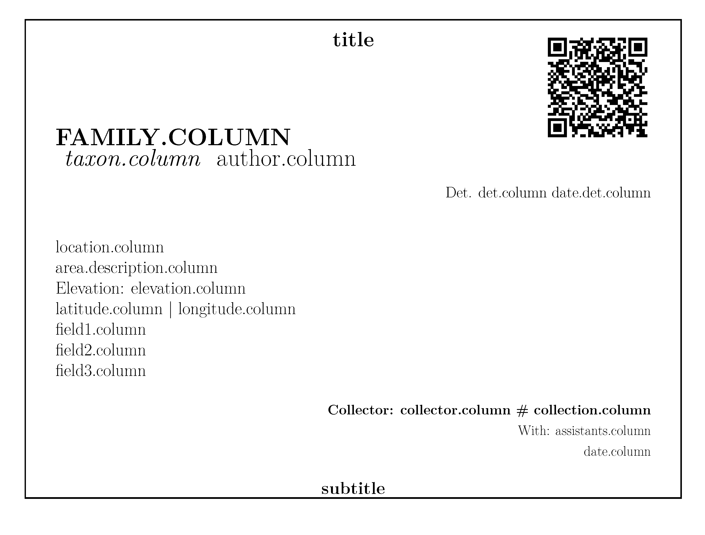
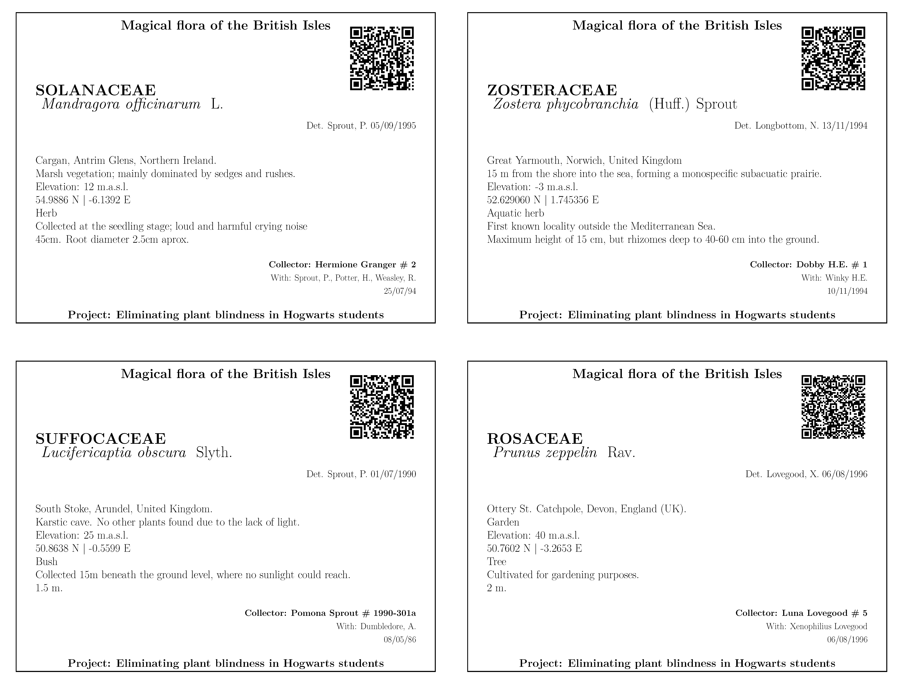

<!-- README.md is generated from README.Rmd. Please edit that file -->

```{r, include = FALSE}
knitr::opts_chunk$set(
  collapse = TRUE,
  comment = "#>",
  fig.path = "man/figures/README-",
  out.width = "100%"
)
```

# labeleR


This is a package to create your own labels, certificates, and much
more! :)

If you need to create your attendance or participation certificates,
accreditation badges, herbarium or collection labels, labeleR is the
package you need! Keep an eye on this easy tutorial on how to use it!

## Installing labeleR

To install **labeleR** from GitHub, you might need to install the
*devtools* package. Once you have it, you just have to specify the
repository and install!

```{r install labeleR, eval=F}
# install.packages("devtools")
devtools::install_github("EcologyR/labeleR")
```

If you want to clone the repository, you can find the code
[here](https://github.com/EcologyR/labeleR).

### TinyTeX

**labeleR** depends on LaTeX, so you must have it also installed. We
recommend using [TinyTeX](https://yihui.org/tinytex/).

First, you would need to install the `tinytex` R package, and then run
the installation:

```{r install LaTeX, eval=F}
# install.packages("tinytex")
tinytex::install_tinytex()
```

The first time you install tinytex or use **labeleR** it may take a
while until all packages are correctly installed. Don't worry, it will
be much quicker next time!

## 1. Getting started

```{r}
library("labeleR")
```

### 1.1 Loading the data

The very first thing you need to start using labeleR is a data frame
where the information is included. This data frame can be imported to
the R environment reading it from a file (e.g. a '.csv' file or '.xlsx'
excel sheet, using `read.table()`, `readxl::read_excel()`, and alike
functions), but it can be also imported from Google Sheets.

To do so, you could use `gsheet2tbl` function from `gsheet` package,
specifying the Google Sheet URL:

```{r loading_data}
library(gsheet)

#URL: https://docs.google.com/spreadsheets/d/1inkk3_oNvvt8ajdK4wOkSgPoUyE8JzENrZgSTFJEFBw/edit#gid=0
people_list_long <- gsheet2tbl("1inkk3_oNvvt8ajdK4wOkSgPoUyE8JzENrZgSTFJEFBw")
```

A key point to bear in mind is that the Google Sheet document must grant
at least view access to anyone with the link; otherwise R will not be
able to open it.

### 1.2 Some advice for the labeleR functions

When using labeleR's functions, there are some widely used arguments and
nomenclature that must be acknowledged.

The first required argument in all functions is `data`, which is the
data frame that has been previously loaded. The second one is `path`,
which is the folder where the output PDFs will be stored. In case the
specified folder does not exist, it will be automatically created. In
case you want to name the output PDF file in a certain way, you must
specify it using the `filename` argument. Additionally, you can store
the created intermediate files (e.g. Rmarkdown and LaTeX files) using
`keep.files = TRUE`.

Ultimately, labeleR uses its own templates to create the documents.
However, these can be modified for specific purposes. To do so, open a
new RMarkdown file in RStudio, using the labeleR template you want to
edit, and after saving it locally, specify its directory path in the
`template` argument.

Pictures (such as logos or signatures) are included in some templates.
For these, argument names are `lpic` (standing for left picture, in the
top), `rpic` (right picture, also in the top) and `signature.pic`
(signature picture) in the certificates; and `logo` in the collection
label. In all these cases the path to the picture file must be provided.

As for the parameters nomenclature, there are two kinds. "Fixed
parameters" are those that remain the same in all the certificates (e.g.
the name of a conference in an accreditation, or the name of a speaker
in an attendance certificate). These parameters are named using a unique
word (e.g. `event` or `speaker`), and can be filled in using free text
that will be printed in all documents. On the other hand, "variable
parameters" are those which vary among documents, and therefore differ
among rows (e.g. attendees names to a conference, or species in
herbarium labels). To specify the column of data in which this
information is stored, two-word parameters are used (i.e. `name.column`
or `species.column`). The only parameter that does not follow this
philosophy is `qr` in the functions that allow to plot them (i.e.
`create_herbarium_label`, `create_collection_label` and
`create_tinylabel`). This parameter can be set as a column name, which
will result in variable parameter, or as a free text (not column name),
which will be used as a fixed one.

## 2. labeleR functions

Now let's start using labeleR!

To help you see the structure of our templates in a more visual way, we
will display some examples inspired in the Harry Potter universe.

### 2.1 Attendance certificates

Attendance certificates are one of the easiest templates; the only
variable parameter is the name of the attendees. Our template allows to
include a signature as an image, so the signer does not have to go
through them all. This certificate is available both in English and
Spanish. In case pictures look too big or small, we recommend to modify
their size, as they are set to have a given height.

The structure of the certificate looks as follows.

|  |
|---------------------------------------------------------------------|

#### Attendance certificate example:

In this example, we create four different certificates for four students
of Hogwarts School, in which the Headmaster certifies they have attended
200 h of the Potions class.

```{r create attendance certificates, eval=FALSE}

create_certificate_attendance(
  data = attendance.table,
  path = "labeleR_output",
  filename = "attendance_certificates",
  language = "English" ,
  name.column = "Names",
  type = "class",
  title = "Potions (year 1992-1993)",
  date = "23/06/1993",
  hours = "200",
  freetext = "taught by Professor S. Snape",
  signer = "A.P.W.B. Dumbledore",
  signer.role = "School Headmaster",
  rpic=system.file("rmarkdown/pictures/Hogwarts_logo.png", package = "labeleR"),
  lpic=system.file("rmarkdown/pictures/Hogwarts_logo.png", package = "labeleR"),
  signature.pic=system.file("rmarkdown/pictures/dumbledore.png", package = "labeleR")
)

```

In this example, each certificate will be rendered in an individual PDF
document.

|  |
|---------------------------------------------------------------------|

### 2.2 Participation certificates

Participation certificates are similar to the previous, but with more
variable parameters (such as speaker, title and type of communication,
etc.). As well as the attendance certificate, these documents can be
rendered in English and in Spanish.

+-----------------------------------------------------------------------+
|                          |
+=======================================================================+
|                                                                       |
+-----------------------------------------------------------------------+

#### Participation certificate example:

Here, Albus Dumbledore certifies that four of the school teachers have
participated in some seminars with different titles, different
affiliations, dates and communication types.

```{r create participation certificates, eval=FALSE}
create_certificate_participation(
  data = participation.table,
  path = "labeleR_output",
  filename = "participation_certificates",
  language = "English",
  name.column = "Name",
  affiliation.column = "House",
  comm.type.column = "Comm.type",
  title.column = "Title",
  date.column = "Date",
  type = "online",
  event = "seminar",
  freetext = "organized by Hogwarts School of Magic and Wizardry",
  signer = "A.P.W.B. Dumbledore",
  signer.role = "School Headmaster",
  rpic=system.file("rmarkdown/pictures/Hogwarts_logo.png", package = "labeleR"),
  lpic=system.file("rmarkdown/pictures/MinMagic.png", package = "labeleR"),
  signature.pic=system.file("rmarkdown/pictures/dumbledore.png", package = "labeleR")
)
```

In this example, each certificate will be rendered in an individual PDF
document.

+-----------------------------------------------------------------------+
|               |
+=======================================================================+
|                                                                       |
+-----------------------------------------------------------------------+

### 2.3 Badges

Badges (and all documents from now onwards) are rendered in a single
document, with eight accreditation cards per DIN-A4 page in this case.
They have only two variable fields (name and affiliation), and can
include two top images, although are not signed. Accreditation cards
include a dot line in the bottom for individual hand-edition.

|  |
|-------------------------------------------------|

#### Badges example:

As an example, we present the accreditation cards that might have been
used in the International Conference of Muggleology, where the only
changing fields are names and affiliations of attendees.

```{r create accreditations, eval=FALSE}

create_badge(
  data = badges.table,
  path = "labeleR_output",
  filename = "badges",
  event = "INTERNATIONAL CONFERENCE OF MUGGLEOLOGY",
  name.column = "List",
  affiliation.column = "Affiliation",
  rpic=system.file("rmarkdown/pictures/Hogwarts_logo.png", package = "labeleR"),
  lpic=system.file("rmarkdown/pictures/minMagic.png", package = "labeleR")
)
```

|  |
|-------------------------------------------|

### 2.4 Herbarium labels

Herbarium labels are one of the documents with more variable parameters,
as there is a lot of information to be included. Here, we have used a
template we believe is the most useful, but we have included three free
fields for the user to include the information they prefer. Of course, a
field's name does not force the user to use it for that category
(location can be set in the elevation column, on top; and vice versa),
but the `family.column` content will always be capitalized, and the
`taxon.column` one in italics, so we recommend to use them as stated.

As said before, the QR can stand for a free text (and therefore remain
identical in all labels), or be a column name, and therefore the codes
will be rendered to specify the individual information in each row.

Including too long texts may cause the alteration of the structure of
the labels, so we recommend to be concise.

|  |
|-------------------------------------------------------------|

#### Herbarium labels example:

In this example, we show the labels some students have created for their
herbarium assignment of the Herbology class.

```{r herbarium labels, eval=FALSE}
create_herbarium_label(
  data = herbarium.table,
  path = "labeleR_output",
  filename = "herbarium_labels",
  qr="QR_code",
  title ="Magical flora of the British Isles" ,
  subtitle = "Project: Eliminating plant blindness in Hogwarts students",
  family.column = "Family",
  taxon.column = "Taxon",
  author.column = "Author",
  det.column = "det",
  date.det.column = "Det_date",
  location.column = "Location",
  area.description.column = "Area_description",
  latitude.column = "Latitude",
  longitude.column = "Longitude",
  elevation.column = "Elevation",
  field1.column = "life_form",
  field2.column = "Observations",
  field3.column = "Height",
  collector.column = "Collector",
  collection.column = "Collection_number",
  assistants.column = "Assistants",
  date.column = "Date"
)

```

|  |
|---------------------------------------------------------------|

### 2.5 Collection labels

Collection labels are one of the most aesthetic labels. They have five
variable parameters (which are not recommended to be too long, as
explained in the herbarium labels), along with the possibility of
including a QR code (fixed or variable), a logo image. Field 1 will be
capitalized (as in `family.column` in the herbarium label, and Field 2
italicized). Any of the fields can be left blank.

As a novelty, the user may manually fix the backgroud and text colours
to their preference, using HTML colour codes (same code as HEX, but
without the '\#'). By default, background colours are two hues of green.

+-----------------------------------------------------------------------+
|  |
+=======================================================================+
|                                                                       |
+-----------------------------------------------------------------------+

#### Collection labels example:

In this example we can see six labels created for the school's displayed
collection of stuffed animals.

```{r collection labels, eval=FALSE}
create_collection_label(
  data = label.table,
  path = "labeleR_output",
  filename = "labels",
  qr="QR_code",
  field1.column = "field1",
  field2.column = "field2",
  field3.column = "field3",
  field4.column = "field6",
  field5.column = "field7",
  system.file("rmarkdown/pictures/Hogwarts_BnW.png", package = "labeleR"),
  bgcolor = "D0ECC1",  #White is "FFFFFF",
  textcolor = "1E3F20" #Black is "000000"
)
```

|  |
|-----------------------------------------------------------------|

### 2.6 Collection tinylabels

This type of labels is a simplified version of the previous, and
includes just five variable fields and the possibility of including a QR
code.

We recommend as in the previous cases not to include too long texts
neither in the variable parameters nor in the QR, as they can become
difficult to read.

Tinylabels are printed in arrays of 8x2 labels per page. In case this
size is too big for the pretended use (as can happen for small insect
collections, for example), we recommend to use the "print several pages
per sheet" in the printer's options.

|  |
|---------------------------------------------------------|

#### Tinylabels example:

Here, tinylabels are created for typical collections stored in boxes, so
a normal collection label would be to big.

```{r tinylabels, eval=FALSE}
create_tinylabel(
  data = tiny.table,
  qr="QR_code",
  path = "labeleR_output",
  filename = "tinylabels",
  field1.column ="field2",
  field2.column ="field1",
  field3.column ="field3",
  field4.column ="field4",
  field5.column ="field5" 
)

```

|  |
|---------------------------------------------------|

## Citation

If using this package, please cite it:

```{r citation, eval=TRUE}
citation("labeleR")
```

## Funding

The development of this software has been funded by Fondo Europeo de
Desarrollo Regional (FEDER) and Consejería de Transformación Económica,
Industria, Conocimiento y Universidades of Junta de Andalucía (proyecto
US-1381388 led by Francisco Rodríguez Sánchez, Universidad de Sevilla).
