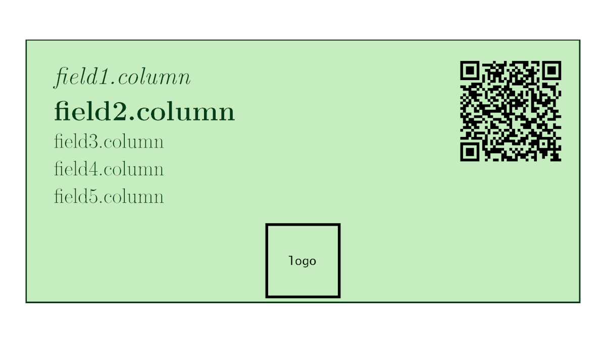
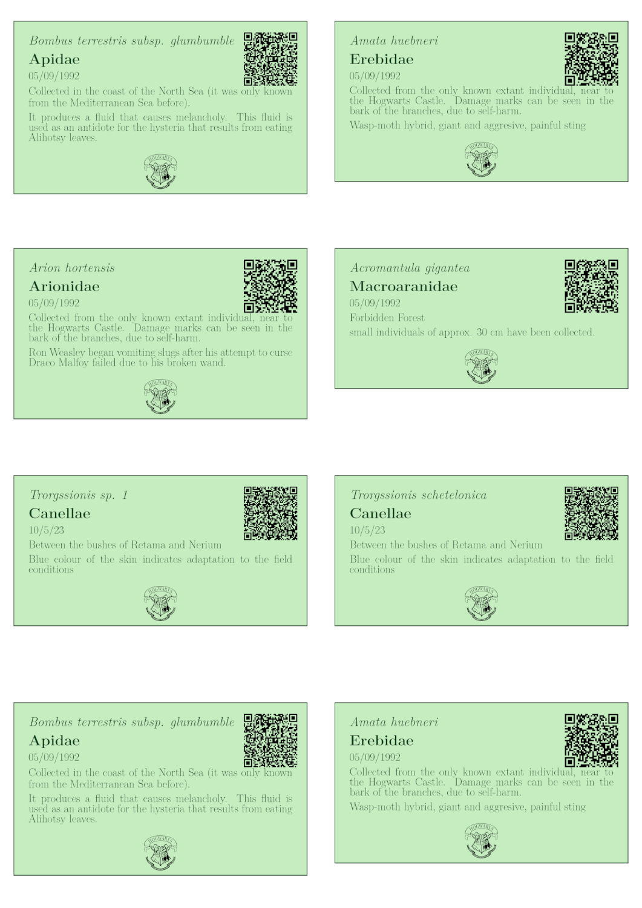

<!-- README.md is generated from README.Rmd. Please edit that file -->

```{r, include = FALSE}
knitr::opts_chunk$set(
  collapse = TRUE,
  comment = "#>",
  fig.path = "man/figures/README-",
  out.width = "100%"
)
```

# labeleR

<!-- badges: start -->

`r badger::badge_cran_release()`

[](https://github.com/EcologyR/labeleR/actions/workflows/R-CMD-check.yaml)
`r badger::badge_lifecycle("stable")`
`r badger::badge_repostatus("Active")`
<!-- [](https://hits.dwyl.com/EcologyR/labeleR) -->
<!-- [](https://hits.dwyl.com/EcologyR/labeleR) -->
[](https://cran.r-project.org/package=labeleR)

<!-- badges: end -->


Have you ever thought, if there was an automatic way…? labeleR is an R package to optimize the creation of your own collection labels, scientific documentation for events, and much more! 🏷️

If you need to create your labels (for your lab, plant
vouchers, insect collections), attendance, participation certificates or
accreditation badges (to a course, a congress)... labeleR is the answer!
Decide which function to use, copy the code into your console, modify it
and run! Keep an eye 👀 on this easy tutorial on how to use it 👇

## Installing labeleR

To install the latest stable version of **labeleR** from CRAN, just use
`install.packages()` function.

```{r install labeleR CRAN, eval=F}
install.packages("labeleR")
```

However, if you want to install the latest version of **labeleR** from
GitHub, you might need to install the *devtools* package. Once you have
it, you just have to specify the repository and install:

```{r install labeleR GH, eval=F}
# install.packages("devtools")
devtools::install_github("EcologyR/labeleR")
```

Ps. If you want to clone the repository, you can find the code
[here](https://github.com/EcologyR/labeleR).

### TinyTeX

**labeleR** depends on LaTeX, so you must have it also installed. We
recommend using [TinyTeX](https://yihui.org/tinytex/).

First, you would need to install the `tinytex` R package:

```{r install LaTeX, eval=F}
# install.packages("tinytex")
tinytex::install_tinytex()
```

⏱️ The first time you install tinytex or use **labeleR** it may take a
while until all packages are correctly installed. Don't worry, it will
be much quicker next time!

#### TinyTeX troubleshooting

In case you have problems installing `TinyTeX`'s packages, try running
this in your console:

```{r TinyTeX pkgs, eval = FALSE}
    tinytex::tlmgr_install(pkgs = c( "zref", "needspace", "pagecolor",
                                     "bookmark", "changepage", "fp",
                                     "mdframed", "ms", "pgf", 
                                     "pspicture", "qrcode"))
```

## 1. Getting started

```{r load labeleR, eval = FALSE}
library("labeleR")
```

### 1.1 Loading the data

The very first thing you need to start using labeleR is a dataset where
the information is included. This dataset can be imported to the R
environment from a file ('.csv'), excel sheet ('.xlsx'), a Google Sheet,
using `read.table()`, `readxl::read_excel()`, `gsheet::gsheet2tbl()` and
alike functions.

Here an example of a dataset imported from a Google Sheet URL:

```{r loading_data}
library(gsheet)

#URL: https://docs.google.com/spreadsheets/d/1inkk3_oNvvt8ajdK4wOkSgPoUyE8JzENrZgSTFJEFBw/edit#gid=0
people_list_long <- gsheet2tbl("1inkk3_oNvvt8ajdK4wOkSgPoUyE8JzENrZgSTFJEFBw")
```

A key point is that the Google Sheet document must grant at least view
access to anyone with the link; otherwise R will not be able to open it.

### 1.2 Some advice for the labeleR functions

When using labeleR's functions, there are some widely used arguments and
nomenclature you should be aware of.

The first required argument in all functions is `data`, which is the
data frame that has been previously loaded. The second one is `path`,
which is the folder where the output PDFs will be stored. In case the
specified folder does not exist, it will be automatically created. If
you want to name the output PDF file in a certain way, you must specify
it using the `filename` argument. Additionally, you can store the
created intermediate files (e.g. RMarkdown, picture files) using
`keep.files = TRUE`.

Ultimately, labeleR uses its own templates to create the documents.
However, these can be modified for specific purposes. To do so, open a
RMarkdown file in RStudio from the labeleR template you want to edit,
and after saving it locally, specify its directory path in the
`template` argument.

RStudio \> File \> New File \> RMarkdown... \> From Template \>
{LabeleRTemplate.Rmd}

Pictures (such as logos or signatures) are included in some templates.
For these, argument names are `lpic` (standing for left picture, in the
top), `rpic` (right picture, also in the top), `signature.pic`
(signature picture) in the certificates, and `logo` in the collection
label. In all these cases the path to the picture file must be provided.

As for the arguments nomenclature, there are two kinds. On the one hand,
the "fixed" arguments, which are those that remain the same in all the
documents (e.g. the name of a conference in an accreditation, or the
name of a herbarium institution). These arguments are named using a
unique word (e.g. `event` or `speaker`), and can be filled in using free
text. On the other hand, "variable" arguments are those which vary among
documents, and therefore differ among rows (e.g. attendees names to a
conference, or species in herbarium labels). To specify the column of
data in which this information is stored, two-word parameters are used
(i.e. `name.column` or `species.column`). The only argument that does
not follow this philosophy is `qr` (present in `create_herbarium_label`,
`create_collection_label` and `create_tiny_label`). This parameter can
be set as a column name, used as a "variable" argument, or as a free
text,as a "fixed" one.

## 2. labeleR functions

Now let's start using labeleR!

Here we will display a blank example to help you see the internal
template structure, accompanied by some examples inspired in the Harry
Potter universe! 🔮

### 2.1 Collection labels

#### 2.1.1 Herbarium labels

Herbarium labels are one of the documents with more variable parameters,
as there is a lot of information that can be included. Here, we have
chosen what we consider to be the most useful parameters, but we have
included three free fields for the user to include the information they
prefer. Of course, a field's name does not force the user to use it for
that category (location can be set in the elevation column, on top; and
vice versa), but be aware that the `family.column` content will always
be capitalized, and the `taxon.column` one in italics, so those ones we
recommend to use them as stated.

As said before, the QR can stand for a free text (and therefore remain
identical in all labels), or be a column name, and the codes will be
rendered with the individual information of each row. Four different
labels will fit in each of the A4 pdf pages.

Warning! Including too long texts may cause the alteration of the
structure of the labels, so we recommend to be concise (specially with
area description!)

|  |
|-------------------------------------------------------------|

##### Herbarium labels example:

In this example, we show the labels some students have created for their
herbarium assignment of the Herbology class.

```{r herbarium labels, eval=FALSE}
create_herbarium_label(
  data = herbarium.table,
  path = "labeleR_output",
  filename = "herbarium_labels",
  qr = "QR_code",
  title ="Magical flora of the British Isles" ,
  subtitle = "Project: Eliminating plant blindness in Hogwarts students",
  family.column = "Family",
  taxon.column = "Taxon",
  author.column = "Author",
  det.column = "det",
  date.det.column = "Det_date",
  location.column = "Location",
  area.description.column = "Area_description",
  latitude.column = "Latitude",
  longitude.column = "Longitude",
  elevation.column = "Elevation",
  field1.column = "life_form",
  field2.column = "Observations",
  field3.column = "Height",
  collector.column = "Collector",
  collection.column = "Collection_number",
  assistants.column = "Assistants",
  date.column = "Date"
)

```

|  |
|---------------------------------------------------------------|

#### 2.1.2. Collection labels

Collection labels are one of the most aesthetic labels. They have five
variable parameters (which are not recommended to be too long, as
explained in the herbarium labels), along with the possibility of
including a QR code (fixed or variable), an image (logo or picture).
Field 1 will be always capitalized (as in `family.column` in the
herbarium label), and Field 2 italicized. Any field can be left blank.

As a novelty, the user may manually fix the backgroud and text colors to
their preference, using HTML color codes (same code as HEX, but without
the '\#'). By default, background colors are two hues of green. Eight
different labels will fit in each of the A4 pdf pages.

|  |
|---------------------------------------------------------------|

##### Collection labels example:

In this example we can see six labels created for the school's displayed
collection of stuffed animals.

```{r collection labels, eval=FALSE}
create_collection_label(
  data = collection.table,
  path = "labeleR_output",
  filename = "labels",
  qr = "QR_code",
  field1.column = "field1",
  field2.column = "field2",
  field3.column = "field3",
  field4.column = "field6",
  field5.column = "field7",
  system.file("rmarkdown/pictures/Hogwarts_BnW.png", package = "labeleR"),
  bgcolor = "D0ECC1",  #White is "FFFFFF",
  textcolor = "1E3F20" #Black is "000000"
)
```

|  |
|-----------------------------------------------------------------|

### 2.1.3 Tiny labels

This type of labels is a simplified version of the previous, and
includes just five variable fields and the possibility of including a QR
code.

We recommend as in the previous cases not to include too long texts
neither in the variable arguments nor in the QR, as they can become
difficult to read.

16 different labels will fit in each of the A4 pdf pages. In case this
size is too big for the pretended use (as can happen for small insect
collections, for example), we recommend to use the "print several pages
per sheet" in the printer's options.

|  |
|---------------------------------------------------------|

#### Tinylabels example:

Here, tiny labels are created for typical collections stored in insect
collection boxes, so a normal collection label would be too big.

```{r tinylabels, eval=FALSE}
create_tiny_label(
  data = tiny.table,
  qr = "QR_code",
  path = "labeleR_output",
  filename = "tinylabels",
  field1.column ="field2",
  field2.column ="field1",
  field3.column ="field3",
  field4.column ="field4",
  field5.column ="field5" 
)

```

|  |
|---------------------------------------------------|

### 2.2. Documents for scientific events

#### 2.2.1. Abstract book

Abstract books result in a single document with multiple pages. Each
abstract will appear on a different page, following the same order as in
the dataframe rows. If other order of appearance is desired, just
arrange your columns in the original dataframe. Each page will include
four variable fields (title, author names, affiliations and the abstract
texts). The output document can include a table of contents with the
titles and page numbers of all abstracts. Additionally, you can also
insert a front page that will appear at the beginning of the document.

#### Abstract book example:

Here we create a document with several abstracts that were presented at
the XXX Congress, including a cover and a table of contents. In the
image we present the first four pages.

```{r create abstractbook, eval=FALSE}
create_abstractbook(
data=abstract.table,
path = "labeleR_output",
filename = "congress_abstractbook",
title.column = "abstract_title",
authors.column = "authors",
affiliation.column = "affiliation",
text.column = "abstract_text",
title.cex = 20,
authors.cex = 15,
affiliations.cex = 14,
text.cex = 12,
frontpage = "Congress_frontpage.pdf"
)
```

#### Abstract book example:

As an example, we present the accreditation cards that might have been
used in the International Conference of Muggleology, where the only
changing fields are names and affiliations of attendees.

|  |
|------------------------------------------------------|

### 2.2.2. Badges

Badges can be used for personal accreditation in congresses, courses,
meetings, etc. They have only two variable fields (name and
affiliation), and can include two top logos or images, although are not
signed. Accreditation cards include a dot line in the bottom for
individual hand-edition.

|  |
|-------------------------------------------------|

#### Badges example:

```{r create accreditations, eval=FALSE}
create_badge(
  data = badges.table,
  path = "labeleR_output",
  filename = "badges",
  event = "INTERNATIONAL CONFERENCE OF MUGGLEOLOGY",
  name.column = "List",
  affiliation.column = "Affiliation",
  rpic = system.file("rmarkdown/pictures/Hogwartslogo.png", package = "labeleR"),
  lpic = system.file("rmarkdown/pictures/MinMagic.png", package = "labeleR")
)
```

As an example, we present the accreditation cards that might have been
used in the International Conference of Muggleology, where the only
changing fields are names and affiliations of attendees.

|  |
|-------------------------------------------|

#### 2.2.3. Attendance certificates

**NOTE:** It is possible to send certificates automatically via email! To see how go to the FAQ section!

Attendance certificates are one of the easiest templates; the only
variable parameter is the name of the attendees. Our template allows to
include a signature as an image, so the signer does not have to go
through them all. This certificate is available both in English and
Spanish. In case pictures look too big or small, it is possible to
modify their size in the template.

The structure of the certificate looks as follows:

|  |
|---------------------------------------------------------------------|

##### Attendance certificate example:

In this example, we create four different certificates for four students
of Hogwarts School, in which the Headmaster certifies they have attended
200 h of the Potions class.

```{r create attendance certificates, eval=FALSE}

create_attendance_certificate(
  data = attendance.table,
  path = "labeleR_output",
  filename = "attendance_certificates",
  language = "English" ,
  name.column = "Names",
  type = "class",
  title = "Potions (year 1992-1993)",
  date = "23/06/1993",
  hours = "200",
  freetext = "taught by Professor S. Snape",
  signer = "A.P.W.B. Dumbledore",
  signer.role = "School Headmaster",
  rpic = system.file("rmarkdown/pictures/Hogwartslogo.png", package = "labeleR"),
  lpic = system.file("rmarkdown/pictures/Hogwartslogo.png", package = "labeleR"),
  signature.pic = system.file("rmarkdown/pictures/dumbledore.png", package = "labeleR")
)

```

In this example, each certificate will be rendered in an individual PDF
document.

|  |
|---------------------------------------------------------------------|

#### 2.2.4 Participation certificates

Participation certificates are similar to the previous, but with more
variable parameters (such as speaker, affiliation, title, etc.). As well
as the attendance certificate, these documents can be rendered in
English and in Spanish.

|  |
|------------------------------------------------------|

#### Participation certificate example:

Here, Albus Dumbledore certifies that four of the school teachers have
participated in some seminars with different titles, different
affiliations, dates and communication types.

```{r create participation certificates, eval=FALSE}
create_participation_certificate(
  data = participation.table,
  path = "labeleR_output",
  filename = "participation_certificates",
  language = "English",
  name.column = "Name",
  affiliation.column = "House",
  comm.type.column = "Comm.type",
  title.column = "Title",
  date.column = "Date",
  type = "online",
  event = "seminar",
  freetext = "organized by Hogwarts School of Magic and Wizardry",
  signer = "A.P.W.B. Dumbledore",
  signer.role = "School Headmaster",
  rpic = system.file("rmarkdown/pictures/Hogwartslogo.png", package = "labeleR"),
  lpic = system.file("rmarkdown/pictures/MinMagic.png", package = "labeleR"),
  signature.pic = system.file("rmarkdown/pictures/dumbledore.png", package = "labeleR")
)
```

In this example, each certificate will be rendered in an individual PDF
document in a common folder.

|  |
|------------------------------------------------------|


### 2.3. Other functions

The ´labeleR´ philosophy is quite simple: creating documents with a
constant structure but varying dataset information. Then, the future of
labeleR is encouraging and unpreditable, able to include multiple and
diverse options! For now, we have included a new function dedicated to
ease teaching tasks!

#### 2.3.1. Multichoice exams

The aim of this function is to randomize the questions and possible
answers inside a multiple choice exam to obtain different versions. This
can solve one of the main teachers' tasks: prepare exams with different
answers to avoid students not focused on their own exam during a test,
trying to extract information from their peers within a class (but also
between courses and even among years...!)

This function creates a multiple choice exam, with 4 questions per page
and an optional image associated to each question (please note that the
first page includes the title plus 3 questions). Each time the function
is run, both questions and answer will be randomized. to be able to
obtain the same version of an exam, you must set the same seed number
(note it somewhere!), which can be useful in case we want to recover a
lost version. A solution document with the correct answers underlined if
the argument `solutions` is set to TRUE.

```{r create multichoice, eval=FALSE}
create_multichoice(
  data = multichoice.table,
  path = "labeleR_output",
  filename = "example_exam",
  title = "Example test",
  question.column = "question",
  option1.column = "opt1.correct",
  option2.column = "opt2",
  option3.column = "opt3",
  option4.column = "opt4",
  start = 1,
  solutions=T,
  seeds = c(1:2)
)
```

#### Multiple choice exam example:

|  |
|-------------------------------------------------------------|

## 3. Frequently Asked Questions

## Send certificates automatically using create_certificate functions

Sending attendance or participation certificates one by one by hand can
be a real nightmare, so labeleR can do it for you (do not get scared, it
is really easy!). The only things you need are a gmail account and all
the recipient mail addresses stored in a column of your data frame.

The first thing labeleR needs is permission to send emails. Do not
worry, this will only be required the first time you do it! Function
`configure_email()` will drive you step by step through the whole
process, but if you prefer to do it manually, go to:
<https://myaccount.google.com/apppasswords> and create an app using your
gmail account.

**Warning!** Please bear in mind that the gmail account you use will be
the one sending the emails, and thus visible for all recipients.\
Once accessed, you have to create an app (the name will not be
visible!), and you will be given a password. Save both somewhere safe,
as you will be asked for them any time you use this feature.

Once you have your mailing application, you have to configure the
structure you want to use for the mailing distribution (i.e. subject,
body, and cc or bcc if you wish). To configure it, just run
`configure_email(user = "youruser@gmail.com", app.name = "yourapp")` ,
being *user* your gmail account previously used, and *app.name* the
application name you have already created. Remember to have your
password with you, as you will be asked for it.

```{r, eval=F}
myemail <- configure_email(user     = "s.snape@gmail.com",
                           app.name = "e-owl",
                           subject  = "Potions 1992-1993 Attendance",
                           body     = "Dear student, 
                                       here you have your attendance certificate for this year.
                                       Congratulations for having completed it, but remember keep studying for next year!",
                           cc       = c("albus.dumbledore@hogwarts.co.uk",
                                        "minerva.mcgonagall@hogwarts.co.uk"),
                           bcc      = "cornelius.fudge@min.magic.co.uk"
                           )
```

**Great!** Now you can send all emails as soon as they are rendered.
Just remember to specify the column of your data frame storing each
recipient email address in `email.column` and the created configuration
object (here, myemail) in the `email.info` slot.\
Just for precaution, labeleR will ask if you are **sure** you want to
send them, but if you are, just click "Yes" and they will be sent as
soon as they are rendered!\

-   *Amazing! This is just like magic! (G. Lockhart).*

Here an example of how the recipient will receive the mail:

|  |
|-----------------------------------------|

```{r eval = F}

create_attendance_certificate(
  data = attendance.table,
  path = "labeleR_output",
  filename = "Potions_grades",
  language = "English" ,
  name.column = "Names",
  type = "class",
  title = "Potions (year 1992-1993)",
  date = "23/06/1993",
  hours = "200",
  freetext = "taught by Professor S. Snape",
  signer = "S. Snape",
  signer.role = "Potions Professor",
  
  email.info = myemail,
  email.column = students.mails
  
)
```

### Including italic or bold texts within a single text

This implementation should be used just to change text formats in only a
part of values stored in columns (variable parameters).

To do so, you must edit the cell value, specifying where the italics
text must start with `\\textit` (or `\\emph`, which allows to open
italics in a reular text, and vice-versa), and `\\end` where it ends;
and `\\textbf` followed by `\\end` for bold text. In case you want to
combine both, you will have to specify `\\end` twice.

For example, this could be helpful to include italics in a species name
which is included as part of a title; where just the species name should
be italicized.

```{r custom italics, eval=FALSE}
seminar.table <- data.frame(
  "Name" = "Rubeus Hagrid",
  "Date" = "01/01/1996",
  "Title" = "Population dynamics of a species of giant spider 
  (\\textitAcromantula gigantea\\end) in Hogwart's Forbidden Forest",
  "Comm.type" = "seminar",
  "Affil" = "Hogwarts Keeper of Keys and Grounds")

create_participation_certificate(
  data = seminar.table,
  path = "labeleR_output",
  filename = "participation_certificates",
  language = "English",
  name.column = "Name",
  affiliation.column = "Affil",
  comm.type.column = "Comm.type",
  title.column = "Title",
  date.column = "Date",
  type = "online",
  event = "seminar",
  freetext = "organized by Hogwarts School of Magic and Wizardry",
  signer = "A.P.W.B. Dumbledore",
  signer.role = "School Headmaster",
  rpic = system.file("rmarkdown/pictures/Hogwartslogo.png", package = "labeleR"),
  lpic = system.file("rmarkdown/pictures/MinMagic.png", package = "labeleR"),
  signature.pic = system.file("rmarkdown/pictures/dumbledore.png", package = "labeleR")
)
  
```

|  |
|-------------------------------------------------------------|


## Citation

```{r citation, eval=TRUE}
citation("labeleR")
```

## Funding

The development of this software has been funded by the European Union -
Next Generation EU, Fondo Europeo de Desarrollo Regional (FEDER) and
Consejería de Transformación Económica, Industria, Conocimiento y
Universidades of Junta de Andalucía (proyecto US-1381388 led by
Francisco Rodríguez Sánchez, Universidad de Sevilla).
