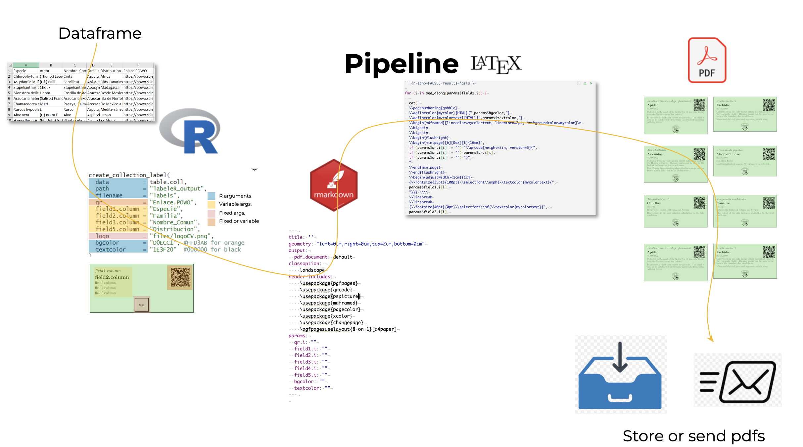

# Summary

LabeleR is a R package designed to automate the creation of scientific collection labels and event documents. It simplifies repetitive and time-consuming tasks, offering a practical alternative to manual tools or costly, complex software. With LabeleR, users can generate a wide variety of customizable PDF documents for storage or automatic email distribution.

The package provides eight core functions: three for managing scientific collections (herbarium labels, collection labels, and compact "tinylabels") and four for organizing scientific events (personal badges, abstract books and certificates of attendance or participation). Users can easily select a data source, incorporate QR codes, logos, pictures, customize content, and create custom templates. LabeleR transforms tedious workflows into efficient processes, contributing to greater scientific productivity by simplifying complex documentation tasks. We believe that this versatile tool contributes to scientific efficiency by simplifying complex, time-demanding labelling and organization processes.

# Workflow

This R package consists of eight functions built around a workflow: dataset > R > RMarkdown > LaTeX > PDF. Each function accepts four types of arguments: (1) R-based, including dataframes, paths, and output filenames; (2) fixed, such as the name of the project, event, signer, as well as a path to a logo or image, which remain constant across documents; (3) variable, referring to dataset columns; and (4) mixed, which can be directly entered in the function or linked to dataset columns. Each function is tied to a specific RMarkdown template, allowing a mix of LaTeX language for de desired aesthethic outcome and R code to dynamically insert fixed and variable variables specified in the function. The function also allows custom Rmarkdown templates. The outputs are in pdf format and can be saved locally or automatically emailed to each of the participants for certificate-related functions.





# Citations

Citations to entries in paper.bib should be in
[rMarkdown](https://rmarkdown.rstudio.com/authoring_bibliographies_and_citations.html)
format.

For a quick reference, the following citation commands can be used: -
`@author:2001` -\> "Author et al. (2001)" - `[@author:2001]` -\>
"(Author et al., 2001)" - `[@author1:2001; @author2:2001]` -\> "(Author1
et al., 2001; Author2 et al., 2002)"

# Rendered R Figures

Figures can be plotted like so:

```{r}
plot(1:10)
```

# Acknowledgements

We acknowledge contributions from Brigitta Sipocz, Syrtis Major, and
Semyeong Oh, and support from Kathryn Johnston during the genesis of
this project.

# References
